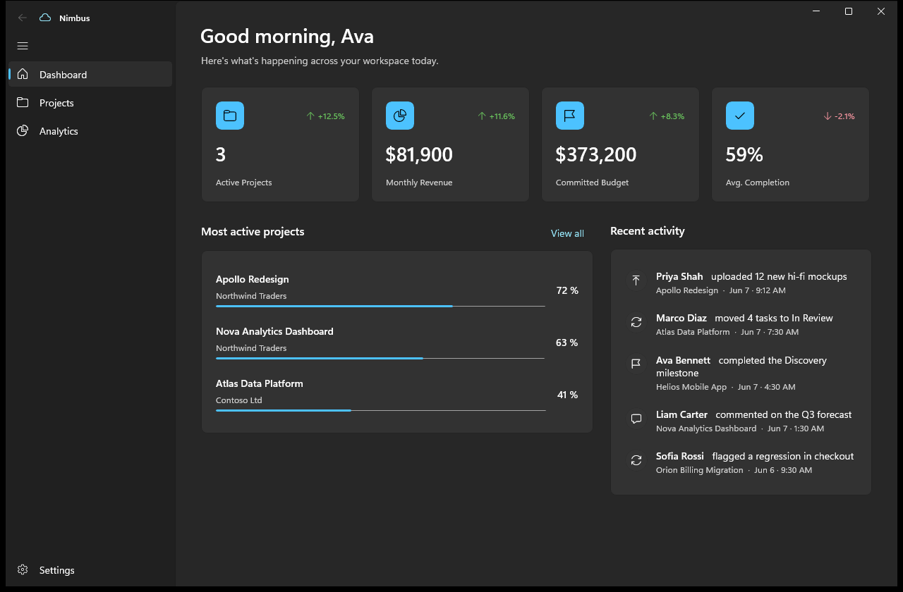

# Nimbus — a WinUI 3 demo workspace

A small but complete **WinUI 3 / .NET 8** desktop app that showcases a modern Fluent
UI with a clean **MVVM** architecture and a strict separation between the UI and the
business logic. It runs as a plain unpackaged `.exe`, so it builds and launches straight
from **VS Code** — no Visual Studio required.



## What it does

A fictional project & analytics workspace:

- **Dashboard** (landing page) — KPI cards, the most active projects, and a live activity feed.
- **Projects** — a filterable portfolio of project cards with status pills, progress and teams.
- **Analytics** — contains **four sub-views in a vertical tab layout**: Overview, Revenue
  (bar chart), Audience (traffic shares) and Performance (service health).
- **Settings** — theme switching (light/dark/system), preference toggles and an About panel.

## Running it

Prerequisites: the **.NET 8 SDK** and **Windows 10 1809+ / Windows 11**. No workload needed —
WinUI 3 comes in via the Windows App SDK NuGet package.

From VS Code: open the folder and press **F5** (uses `.vscode/launch.json`, which builds first).

From a terminal:

```powershell
dotnet build Nimbus.sln -p:Platform=x64
dotnet run --project src/Nimbus.App -p:Platform=x64
```

`dotnet build` already produces a runnable executable at
`src/Nimbus.App/bin/x64/Debug/net8.0-windows10.0.19041.0/win-x64/Nimbus.App.exe` — you can
launch that directly without `dotnet run`.

## Building a distributable

For a clean, shippable build, publish in Release:

```powershell
dotnet publish src/Nimbus.App/Nimbus.App.csproj -c Release -p:Platform=x64
```

The output lands in
`src/Nimbus.App/bin/x64/Release/net8.0-windows10.0.19041.0/win-x64/publish/`. Because the app
is **self-contained**, that folder runs on a machine with no .NET runtime and no Windows App
SDK installed — zip it and hand it over:

```powershell
Compress-Archive -Path "src/Nimbus.App/bin/x64/Release/net8.0-windows10.0.19041.0/win-x64/publish/*" -DestinationPath "Nimbus.zip" -Force
```

Notes:

- The deliverable is the **whole folder**, not a single file. WinUI 3 unpackaged apps can't be
  bundled into one `.exe` (`PublishSingleFile` fails — the native WinAppSDK bootstrapper can't
  be embedded), and `PublishTrimmed` is unsupported because XAML relies on reflection.
- Self-contained bundles are large (~150 MB). To shrink the download you can set
  `SelfContained` / `WindowsAppSDKSelfContained` to `false` in the csproj, but then each
  machine must have the .NET 8 runtime and the Windows App SDK runtime installed.

## Architecture — UI vs. logic

The solution is split into **two projects** to make the boundary obvious and enforceable:

| Project        | Responsibility                                   | References UI? |
| -------------- | ------------------------------------------------ | -------------- |
| `Nimbus.Core`  | Models, dummy data store, **business-logic services** | No (plain `net8.0`) |
| `Nimbus.App`   | Views, view-models, navigation, theming          | Yes (WinUI 3)  |

`Nimbus.Core` cannot reference any UI type — it targets plain `net8.0`. All decisions about
*what the numbers mean* (which projects count as active, how revenue is annualised, how money
is formatted, how traffic shares are computed) live in its services. The app layer only ever
receives finished data.

```
Views (XAML)  ──>  ViewModels  ──>  Nimbus.Core services  ──>  MockDataStore
  (no logic)        (state &           (business logic)         (dummy data)
                     commands)
```

### How the layers stay clean

- **Views hold no logic.** Code-behind is limited to `InitializeComponent`, resolving the
  view-model from DI, and kicking off the load command. Navigation glue lives in services,
  not pages. All formatting/branching is done in view-models or `IValueConverter`s.
- **View-models** orchestrate state and expose `ObservableObject` properties and
  `RelayCommand`s (via the **CommunityToolkit.Mvvm** source generators). They call Core
  services for data and never touch XAML types (except the thin theme service contract).
- **Dependency injection** (`Microsoft.Extensions.DependencyInjection`) wires everything in
  `App.ConfigureServices()`. Core registers itself via `services.AddNimbusCore()`.
- **Reusable, logic-free controls** — `MetricCard` and `SettingRow` are `UserControl`s driven
  entirely by dependency properties.

## Project layout

```
Nimbus.sln
├─ src/Nimbus.Core/                 # business logic — no UI dependency
│  ├─ Models/                       # Project, Metric, ActivityItem, TeamMember, …
│  ├─ Data/MockDataStore.cs         # in-memory dummy data (stands in for a DB/API)
│  ├─ Services/                     # IDashboardService, IProjectService, IAnalyticsService
│  └─ DependencyInjection.cs        # AddNimbusCore()
│
└─ src/Nimbus.App/                  # WinUI 3 presentation layer
   ├─ App.xaml(.cs)                 # DI container + app resources/converters
   ├─ MainWindow.xaml(.cs)          # window, Mica backdrop, custom title bar
   ├─ Services/                     # navigation, page registry, theme selector (UI-only)
   ├─ ViewModels/                   # Shell, Dashboard, Projects, Analytics, Settings
   │  └─ Tabs/                      # one view-model per analytics tab
   ├─ Views/                        # Shell + one page per top-level destination
   │  └─ Tabs/                      # the four vertical-tab sub-views + template selector
   ├─ Controls/                     # MetricCard, SettingRow (reusable, DP-driven)
   ├─ Converters/                   # all value→display conversion
   └─ Styles/Styles.xaml            # shared card / heading styles
```

## Notable WinUI techniques on show

- `NavigationView` shell with a custom, draggable title bar and **Mica** backdrop.
- A **vertical tab layout** built with a `ListView` + `ContentControl` + a
  `DataTemplateSelector`, driven entirely by the view-model's `SelectedTab`.
- Responsive card grids with `ItemsRepeater` + `UniformGridLayout`.
- Lightweight bar/share "charts" composed from primitives, with all scaling pre-computed in
  the view-models so the views just draw.
- Theme switching applied through a small UI service.

## Implementation notes

- The app is **unpackaged** (`WindowsPackageType=None`, self-contained) so it runs as a normal
  executable from VS Code.
- `WindowsSdkPackageVersion` is pinned in the csproj because the installed .NET 8 SDK ships an
  older Windows SDK projection than the Windows App SDK requires.
